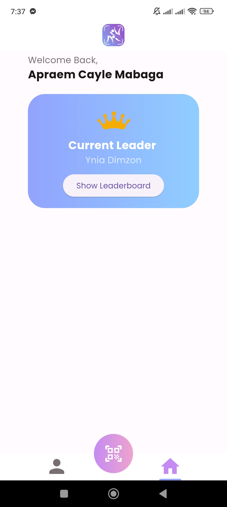

# Hajime
Designed and developed an application that can assist in making a practical and efficient attendance management system and organizing within-team judo competition rating systems. Implemented using Flutter, Android Studio and Dart. 

Adviser: Danilo J. Mercado

## Title
HAJIME: A Mobile-based QR-code Attendance Management System and Elo-based Rating System  Application for Judo Clubs or Teams
## Abstract 
In the context of sports training, specifically in Judo,
one major challenge faced by the team is to put attendances in
every session, and as well as manage them. Another challenge
is lack of integration of within-team competitions along with
appropriate rating system. This study tackled these issues using
QR codes for attendance system and utilizing the Elo rating
system for rating the members of the team/club. Concretely, a
dedicated mobile application tailored to the unique needs of judo
teams or clubs. This application possesses features that not only
streamline attendance management but also facilitate within-
team tournaments seamlessly integrated with the Elo rating
system.

## Features
1) Administrator
- Log in
- Approve Team or CLub
2) Member
- Register
- Log in
- Scan QR Code
- Approve Team or CLub
- View Profile/Account Information
- View Team Elo Ranking
3) Club/Team
- Register
- Log in
- Generate QR Code
- View Profile/Account Information
- Elo Ranker

## Types of User
1) Administrator
- In charge of verifying and approving the teams/clubs
that register in the application
2) Member
- The member inputs the following data to register
into the application:
  - Name
  - Age
  - Weight
  - Address
  - Contact Number
  - Date of start of training
  - Current belt color
  -  A member account logs and scans the QR code
generated by the Club/Team account every time they
attend the training.
- A member account can update his/her current
weight
- A member account can view the team rankings
- A member account can view his/her attendance logs
3) Club/Team
- A club/team account is in charge of assessing the
attendance logs and profile of each member.
- A club/Team account can update the Elo ranking of
a members through the Elo ranker feature.
- A club/team account generates a personal QR code
for the members to scan every time they enter the
training.
- A club/team can update the current belt color of a
member.

## Screenshots
### Login

### SignUp as Player

### SignUp as Team-Admin

### Home Screen of Players

### Home Screen of Team-Admins

### Profile of Players

### Players View Team-Admins

### Attendance History of Players

### Attendance History of Team-Admins

### Match History of Players

### Match History of Team-Admins

### Generate QR Code

### Scan QR Code

### Create a Match (ELO RANKER)

### Cancel a Match 

